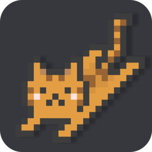

# RunCat 365 MacOS

   
**A cute running cat animation on your MacOS Taskbar.**

If you need for windows, checkout: [https://github.com/Kyome22/RunCat365](https://github.com/Kyome22/RunCat365)

`Swift` `Xcode` `RunCat`

# Demo

# Contributors

